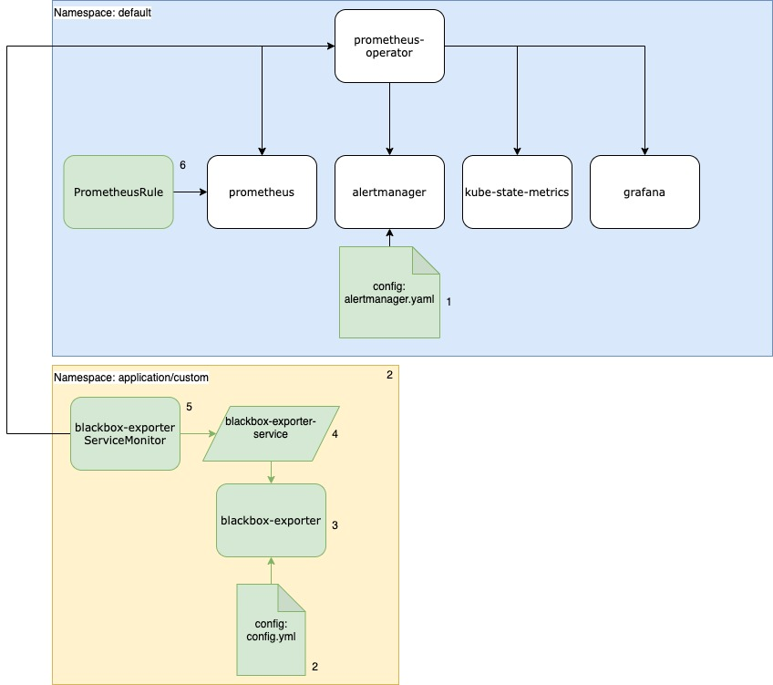

# Prometheus Operator on bonsai made k3s cluster

the Prometheus Operator for Kubernetes provides easy monitoring definitions for Kubernetes services and deployment and management of Prometheus instances.

Once installed, the Prometheus Operator provides the following features:

* Create/Destroy: Easily launch a Prometheus instance for your Kubernetes namespace, a specific application or team easily using the Operator.

* Simple Configuration: Configure the fundamentals of Prometheus like versions, persistence, retention policies, and replicas from a native Kubernetes resource.

* Target Services via Labels: Automatically generate monitoring target configurations based on familiar Kubernetes label queries; no need to learn a Prometheus specific configuration language.

## Prerequisites

tiller needs to be installed first because the operator will be installed via helm 2

```bash
kubectl -n kube-system create serviceaccount tiller
kubectl create clusterrolebinding tiller --clusterrole=cluster-admin --serviceaccount=kube-system:tiller
curl -LO https://git.io/get_helm.sh
chmod 700 get_helm.sh
./get_helm.sh
helm init --service-account tiller
kubectl rollout status deployment tiller-deploy -n kube-system
```

## Quickstart

the prometheus operator can be deployed

```bash
helm install stable/prometheus-operator --name promo --version=8.13.0
```

cleanup the default alerting rules

```bash
./cleanup-prometheus-alerts.sh
```

### Add alertmessages to the alertmanager

alerts are defined in the alertmanager.yaml

```bash
./alertmanager-config.sh
````

when you chanage the alertmanager.yaml deploy the secret with the shellscript.
examples alertconfigurations can be found [here](https://github.com/coreos/prometheus-operator/blob/master/Documentation/user-guides/alerting.md).

### Deploy Blackbox deployment

befor deploying the blackbox exporter pod, you need to deploy the config with this configmap

If you need more probe modules you have to add in this configmap [examples here](https://github.com/prometheus/blackbox_exporter/blob/master/example.yml)

* setup a namespace for separation

  ```bash
  kubectl apply -f example/1-application-ns.yml
  ```

* deploy the scrap configuration

  ```bash
  kubectl apply -f example/2-application-deployment-configmap.yml
  ```

* now deploy the application

  ```bash
  kubectl apply -f example/3-application-deployment.yml
  ```

* get access deploy the service

  ```bash
  kubectl apply -f example/4-application-service.yml
  ```

* deploy prometheus alertrule/s

  ```bash
  kubectl apply -f example/5-application-alertrule.yml
  ```

* deploy ServiceMonitors to connect the service with prometheues targetservice

  ```bash
  kubectl apply -f example/6-application-service.yml
  ```

## Removal

```bash
helm delete --purge prometheus-operator
kn default
kubectl delete crd alertmanagers.monitoring.coreos.com
kubectl delete crd podmonitors.monitoring.coreos.com
kubectl delete crd prometheuses.monitoring.coreos.com
kubectl delete crd prometheusrules.monitoring.coreos.com
kubectl delete crd servicemonitors.monitoring.coreos.com
```

### example

view README.md in the example folder

### Setup



* white shapes: prometheus opertrator defaults
* green shapes: configured and manually deployed
